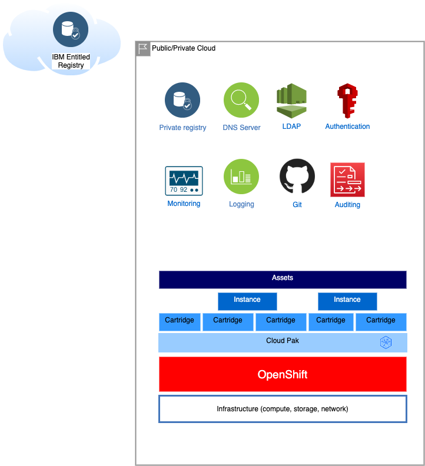

# Deployment topologies

Configuration of the topology to be deployed typically boils down to choosing the cloud infrastructure you want to deploy, then choosing the type of OpenShift and storage, integrating with infrastructure services and then setting up the Cloud Pak(s). For most initial implementations, a basic deployment will suffice and later this can be extended with additional configuration.

Depicted below is the basic deployment topology, followed by a topology with all bells and whistles.

## Basic deployment

For more details on each of the configuration elements, refer to:

* [Infrastructure](../../../30-reference/configuration/infrastructure)
* [OpenShift](../../../30-reference/configuration/openshift)
* [Cloud Pak](../../../30-reference/configuration/cloud-pak)
* [Cloud Pak Cartridges](../../../30-reference/configuration/cp4d-cartridges)
* [Cloud Pak Instances](../../../30-reference/configuration/cp4d-instances)
* [Cloud Pak Assets](../../../30-reference/configuration/cp4d-assets)

## Extended deployment

For more details about extended deployment, refer to:

* [Monitoring](../../../30-reference/configuration/monitoring)
* [Logging and auditing](../../../30-reference/configuration/logging-auditing)
* [Private registry](../../../30-reference/configuration/private-registry)
* [DNS Servers](../../../30-reference/configuration/dns)
* [Cloud Pak for Data LDAP integration](../../../30-reference/configuration/cp4d-ldap)
* [Cloud Pak for Data SAML](../../../30-reference/configuration/cp4d-saml)