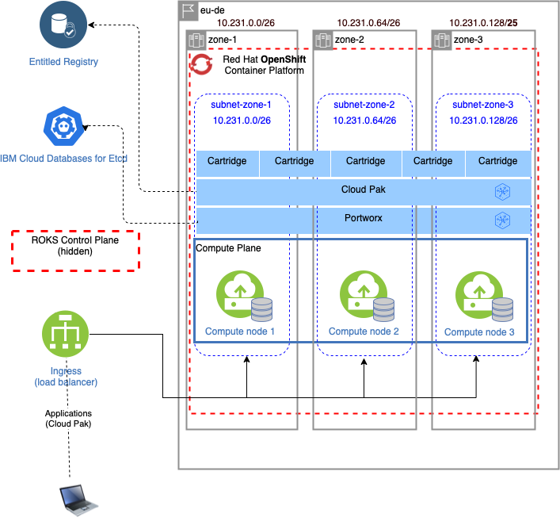

# IBM Cloud ROKS on VPC with Portworx storage classes and Cloud Pak for Data
This is a sample configuration for ROKS on IBM Cloud, provisioned in a VPC with the Portworx storage from an IBM Cloud service. All infrastructure, OpenShift and Cloud Pak for Data are managed by the deployer and deployment requires nothing but an IBM Cloud API key and a Cloud Pak entitlement key.

## Infrastructure

### Virtual Private Cloud on IBM Cloud
The Virtual Private Cloud (VPC) contains all of the assets needed that make up this configuration.

### Zones with address prefixes
The sample configuration is made up of 3 availability zones, each with its own address prefix. Zones 1 and 2 have a netmask of `/26`, which means each zone can provide up to 59 IP addresses (the first 5 addresses in the CIDR block are reserved by IBM Cloud). Zone 3 has a netmask of `/25`, which means it can address 123 IP addresses (128-5).

### Subnets
4 subnets are created. Zones 1 and 2 have a single subnet which span the entire IP address block. Zone 3 is split up into 2 subnets, one for OpenShift workers (zone-3) and one for shared virtual servers such as the bastion and the NFS server.

## IBM Cloud Databases for Etcd
An Etcd managed service is created.  Portworx requires a key-value store for its metadata.

## Block Storage
Block storage is created and attached to each OpenShift worker node.  This storage is used by Portworx to create highly available software defined storage for the OpenShift cluster.

## IBM Cloud Portworx Service
The IBM Cloud Portworx service is created.  This installs Portworx pods to all worker nodes of the OpenShift cluster.  Portworx default storage classes are also created.  CP4D adds additional storage classes with custom properties, optimized to meet the storage requirements of specific cartridges.

## OpenShift
An OpenShift cluster with the specified version (4.6) is provisioned inside the VPC and across subnets 1, 2 and 3.

## Cloud Pak for Data
Cloud Pak for Data 4.0 is installed in OpenShift project `cpd`, pulling images from the IBM entitled registry and referencing the Portworx storage class in OpenShift.

### Cartridges
The sample configuration holds a list of cartridges which will be installed. You can control whether cartridges will be installed by commenting or uncommenting the appropriate blocks. Please ensure that the cartridge elements are aligned (hyphens must be aligned with hyphens and properties with properties).

By default, the following cartridges will be installed:
* Cloud Pak Foundational Services (is installed as part of the Cloud Pak for Data control plane)
* Cloud Pak for Data control plane (mandatory)
* Watson Studio
* Watson Machine Learning
* Watson Knowledge Catalog